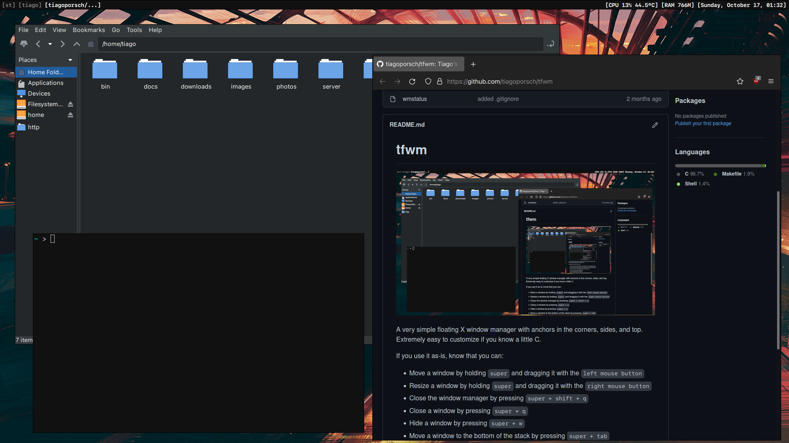

# tfwm

A very simple floating X window manager with anchors in the corners, sides, and top.
Extremely easy to customize if you know a little C.

If you use it as-is, know that you can:
* Move a window by holding `super` and dragging it with the `left mouse button`
* Resize a window by holding `super` and dragging it with the `right mouse button`
* Close the window manager by pressing `super + shift + q`
* Close a window by pressing `super + q`
* Hide a window by pressing `super + w`
* Move a window to the bottom of the stack by pressing `super + tab`
* Switch to the next window by pressing `alt + tab`
* Switching to a specific window by holding `super` and `left-clicking` on the task bar
* Closing a specific window by holding `super` and `right-clicking` on the task bar

But you **should** take a look at the basic configurations, to make sure it will work with your setup.

The status bar is set just like dwm, with a separate script that calls `xsetroot -name [status text]`.
